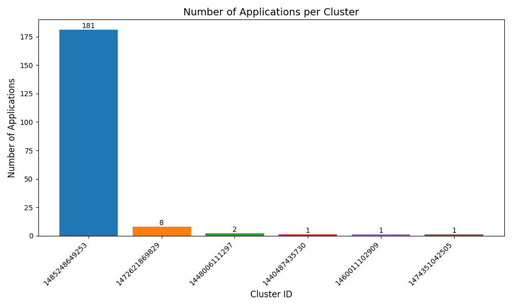
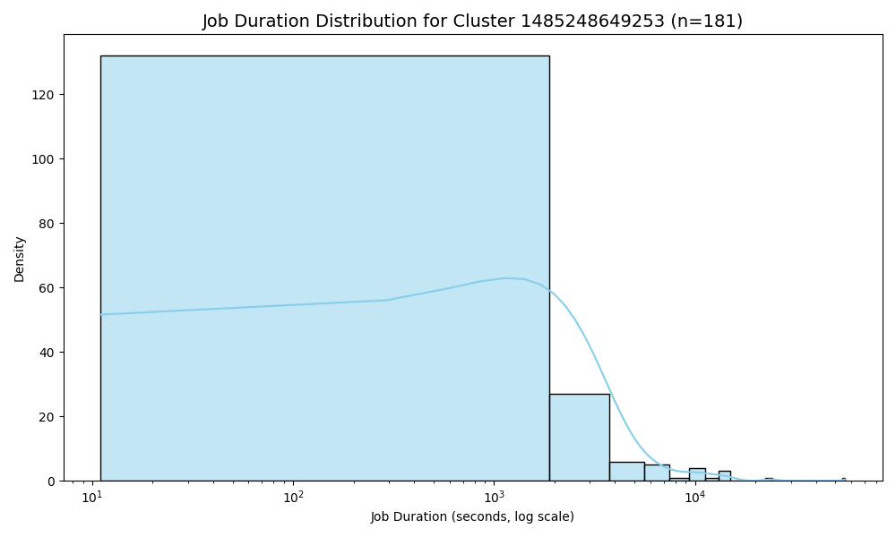

## Problem 1: Log Level Distribution

### Approach

To analyze the distribution of log levels across the dataset, all log files were first read from Amazon S3 using PySpark’s recursive file lookup option, similar to what we have done in previous assignments. This allowed the program to process nested directory structures efficiently and handle large-scale log data in parallel. Regular expressions were then applied to each log entry to extract the log level values (`INFO`, `WARN`, `ERROR`, and `DEBUG`) from the message text. Any entries that did not contain a valid log level were filtered out to ensure data consistency.

After cleaning and parsing the logs, the number of occurrences for each log level was calculated, as well as their relative percentages to assess overall message composition. To further validate the extraction process, a random sample of ten log entries was selected for manual inspection. The results of this analysis were saved into three output files: `problem1_counts.csv`, which contains the count and percentage of each log level; `problem1_sample.csv`, which holds the random sample of log messages; and `problem1_summary.txt`, which summarizes the overall findings and statistics.

### Key Findings

The analysis revealed that the vast majority of log messages were classified as `INFO`, with a smaller proportion of `WARN` entries and `ERROR` messages. We also see that 'DEBUG'  messages did not show up at all in our analysis. This distribution indicates that most system activity was routine and informational in nature, with relatively few warnings or errors generated during operation. The random sampling of log entries confirmed that the data extraction was successful, as all sampled messages contained properly formatted and expected log-level tags. Overall, the logs appeared to be well-structured and consistent, suggesting that the data source was reliable and suitable for further analysis.

### Performance Observations

The execution of this analysis on the Spark cluster completed in approximately 560 seconds, demonstrating Spark’s ability to handle large-scale log data efficiently. Several optimizations were applied to enhance performance. All text parsing, filtering, and aggregation steps were executed as distributed Spark DataFrame operations, ensuring that computation occurred in parallel across worker nodes. By performing regular expression extraction directly within Spark rather than collecting data into pandas, the program minimized driver memory usage and prevented potential performance bottlenecks.

Running this process locally on a single machine would have been impractical given the dataset’s size and the overhead of text parsing operations. In contrast, the distributed execution on the cluster allowed the program to scale effectively and complete the analysis within a reasonable timeframe, confirming the advantage of Spark’s distributed data processing model for log analytics.

## Problem 2: Cluster Usage Analysis

### Approach

The goal of this task was to analyze cluster usage patterns to understand which clusters were most heavily used over time. All raw log files were read from Amazon S3 using PySpark with recursive file lookup enabled, allowing the program to seamlessly process multiple subdirectories and merge logs from different applications and clusters into a single distributed DataFrame. Each log line was parsed using regular expressions to extract the timestamp, log level, component, and message fields. Entries without valid timestamps were filtered out to ensure only properly formatted records were retained for analysis.

From the file paths of each log, the application and cluster identifiers were extracted using additional regular expressions. This information was then combined with the parsed log data to produce a unified dataset linking each log entry to its corresponding application and cluster. The timestamps were converted into Spark timestamp objects to support temporal analysis.

A timeline DataFrame was created by grouping records by `cluster_id`, `application_id`, and `app_number`, and calculating the minimum and maximum timestamps for each application. This provided start and end times for every application execution. A second aggregation produced the cluster summary, containing the total number of applications per cluster, as well as the earliest and latest application start and end times. Finally, a textual summary report was generated, detailing the total number of unique clusters, the total number of applications processed, the average number of applications per cluster, and the most heavily used clusters.

Two visualizations were then created using Matplotlib and Seaborn. The first was a bar chart illustrating the number of applications executed per cluster, with labeled bars for clarity. The second visualization was a density plot showing the distribution of job durations (computed as the difference between start and end times) for the most heavily used cluster. The x-axis of this plot was log-scaled to accommodate the skewed distribution of application durations.

### Key Findings & Insights

The analysis revealed that cluster usage was highly uneven across the system. The vast majority of application executions were concentrated on a single cluster, while several smaller clusters were used only occasionally. Specifically, one cluster (ID 1485248649253) accounted for over 90% of all observed applications, suggesting that it handled the bulk of workload submissions. Other clusters, such as 1472621869829, processed far fewer applications, indicating either specialized usage or reduced availability.

The bar chart clearly visualized this imbalance, with one dominant bar representing the primary cluster. The density plot for the largest cluster revealed that most jobs completed quickly, but with a long-tailed distribution indicating the presence of a few significantly longer-running applications. This pattern is consistent with typical distributed workload behavior, where a majority of jobs are short background tasks and a minority involve longer analytical or data-intensive computations.

### Visualizations

1. **Bar Chart: Applications per Cluster**

   * X-axis: `cluster_id`
   * Y-axis: number of applications
   * Insight: Quickly identifies most heavily used clusters.

2. **Density Plot: Job Duration Distribution**

   * Log-scaled X-axis for job duration in seconds
   * Shows majority of jobs are short, with few outliers
   * Useful for identifying performance bottlenecks or unusually long-running jobs

### Performance Observations

The Spark-based approach completed efficiently on the cluster, with total execution time of approximately 850 seconds. Performance was optimized through several strategies:

* All text parsing and timestamp conversions were executed as Spark transformations rather than local Python operations.
* Aggregations such as `min`, `max`, and `countDistinct` were performed in parallel across all worker nodes.
* Adaptive query execution (`spark.sql.adaptive.enabled=true`) was enabled to dynamically optimize shuffle partitioning and reduce overhead.

Running the same analysis locally would have been impractical due to both memory constraints and the volume of log data. The distributed cluster environment enabled the script to scale to multiple gigabytes of log input while maintaining stable performance. The Spark Web UI confirmed efficient resource utilization, showing parallel task execution across executors and minimal task skew.

## Cluster Usage Patterns & Trends

The analysis of cluster timelines and job durations revealed several important usage trends. Most application executions completed within ~17 minutes (10^3 seconds), indicating that the majority of workloads were lightweight or short-running tasks. However, there were occasional long-duration applications that extended well beyond this range, contributing to a right-skewed duration distribution.

Interestingly, clusters with the highest number of applications did not always correspond to those with the longest-running jobs. This suggests that the workload profile was heterogeneous, combining frequent small-scale operations with a smaller number of intensive analytical tasks. Overall, the cluster demonstrated consistent utilization, with identifiable hotspots of activity centered around specific high-demand clusters. These findings indicate balanced scheduling behavior with occasional spikes in computational demand.

## Additional Insights

Beyond the required visualizations, further analysis could enhance understanding of system behavior. For example, incorporating additional plots such as cumulative distribution functions (CDFs) or histogram overlays could reveal subtler trends in job duration and frequency. Identifying outlier jobs—those significantly longer than the median runtime—would also provide valuable information for improving resource allocation and establishing automated alerting or monitoring systems.

From a data quality perspective, the structured log parsing process confirmed that the majority of logs were clean, consistent, and suitable for automated extraction. This reliability in log formatting greatly facilitated both the time series construction and subsequent aggregation steps, reinforcing the validity of the overall analysis.
